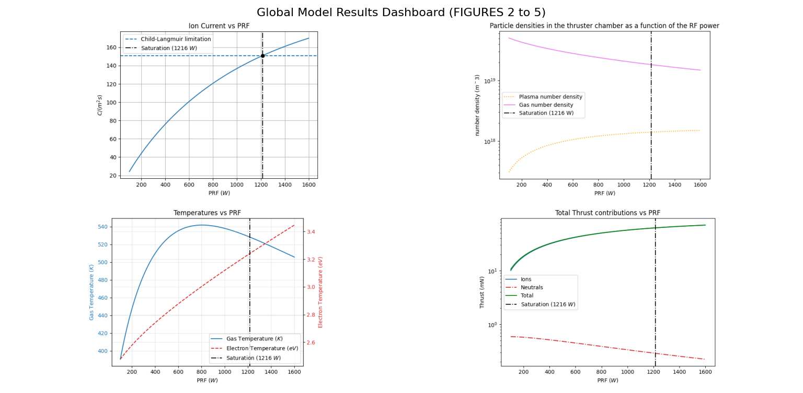
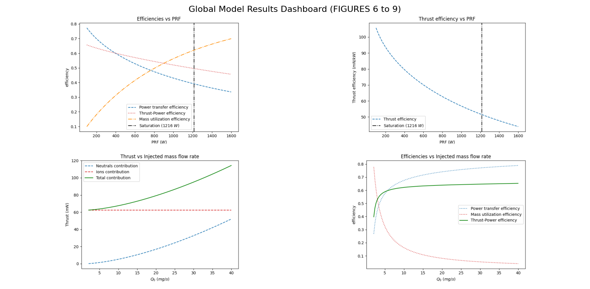

# 🚀 Gridded Ion Thruster — Physics → ML → Real-Time Dashboard

Physics-based simulation and machine learning surrogate model for a RF gridded ion thruster, enabling real-time performance prediction and inverse design optimization.

---

## 📌 Project Overview

This project implements a complete end-to-end pipeline for modeling and optimizing a Gridded Ion Thruster (GIT):

Physics simulation → dataset generation → neural surrogate model → interactive engineering dashboard

The goal is to replace expensive plasma simulations with a fast surrogate model capable of:

- real-time thrust prediction
- exploration of the thruster operating parameter space
- inverse optimization 

The physics model is based on:

> Global model of a gridded-ion thruster powered by a radiofrequency inductive coil  
> Chabert et al., Physics of Plasmas (2012)  
> DOI: 10.1063/1.4737114  

---

## 🧭 Pipeline Architecture

```
Phase 1 — Physics Solver (0D plasma model)
        ↓
Phase 2 — Synthetic dataset generation (5k simulations)
        ↓
Phase 3 — Neural surrogate model training
        ↓
Phase 4 — Real-time interactive dashboard
```

Each phase is modular and can be run independently.

---

# ⚛️ Phase 1 — 0D Global Model (Physics Solver)

Physics-based ground truth solver for the plasma inside the discharge chamber.

## Overview

Implements a zero-dimensional global plasma model that solves coupled ODEs describing:

- plasma density  
- neutral density  
- electron temperature  
- gas temperature  

The solver integrates until steady-state and is used as:

- ground truth generator  
- validation baseline  
- dataset generator for ML model  

### State Variables

- `n` — plasma density (m⁻³)  
- `ng` — neutral gas density (m⁻³)  
- `Te` — electron temperature (eV)  
- `Tg` — neutral gas temperature (K)  

### Simulation Routines

**Power Sweep**

RF Power: 100 → 1600 W  
Used to validate behavior against literature.

**Mass Flow Optimization**

Mass flow: 0.5 → 40 mg/s  
Finds saturation where:

```
Ion current density → Child-Langmuir limit
```

### Outputs

Two analysis dashboards with key figures:

- ion current density vs power  
- densities vs power  
- temperatures vs power  
- thrust components  
- efficiency metrics  
- thrust vs mass flow  

### Generated figures




### Run
```bash
python physics_solver.py
```

### Dependencies
```
numpy
scipy
matplotlib
```

---

# 📊 Phase 2 — Synthetic Dataset Generation

Transforms physics simulations into a dataset for ML training.

## Goal

Generate 5,000 operating points across the thruster envelope.

**Why:**
- physics solver = slow (seconds per run)  
- ML requires large dataset  
- enables real-time prediction later  

## Techniques

### Latin Hypercube Sampling
Ensures uniform coverage of parameter space.

Ranges:
- RF Power: 50 → 2500 W  
- Mass flow: 0.5 → 40 mg/s  

### Parallel Computing
Uses Python multiprocessing:
- splits workload across CPU cores  
- near-linear speedup  
- reduces runtime from hours to minutes  

## Output Dataset
```
GlobalModel_Dataset.csv
(in the folder there is also dataset.png, a plot tho rapresent the data generated during the Phase 2)
```

Columns:

| Input_Power_W | Input_Flow_mg_s | Output_Thrust_mN | Success |
|---------------|----------------|------------------|---------|

### Run
```bash
python data_processing.py
```

### Dependencies
```bash
pip install pandas scipy
```

---

# 🧠 Phase 3 — ML Surrogate Model

Neural network approximating the plasma physics model.

## Goal
Replace ODE solver with fast inference model.

Result:
```
seconds → milliseconds
```

## Data Pipeline

- Remove failed simulations  
- Train/test split (80/20)  
- Min-max normalization  
- Save scalers for deployment  

## Neural Architecture

| Layer | Neurons | Activation |
|------|--------|------------|
| Input | 2 | — |
| Dense | 64 | ReLU |
| Dense | 64 | ReLU |
| Output | 1 | Linear |

Loss: MSE  
Optimizer: Adam  
Epochs: 100  
Batch: 32  

## Generated Artifacts
```
git_surrogate_model.keras
scaler_X.pkl
scaler_y.pkl
```

### Run
```bash
python train_model.py
```

### Dependencies
```bash
pip install tensorflow scikit-learn joblib pandas matplotlib
```

---

# 🖥️ Phase 4 — Interactive Dashboard

Real-time engineering interface for simulation and optimization.

## Features

### Real-Time Prediction

Interactive sliders:
- RF Power  
- Mass Flow  

Pipeline:
```
input → normalization → NN inference → denormalization → thrust
```

Latency: < 50 ms

### Inverse Design Optimization

Target thrust → find optimal configuration.

Monte Carlo search:
- 50k random configurations  
- filter by target thrust  
- return optimal solutions  

Outputs:
- minimum power configuration  
- minimum propellant configuration  

### Robustness
- cached model loading  
- error handling  
- fast UI response  

### Run Dashboard
```bash
streamlit run app.py
```

### Dependencies
```bash
pip install streamlit tensorflow pandas numpy joblib
```

---

# 🧩 Project Structure
```
physics_solver.py
data_processing.py
train_model.py
app.py

git_surrogate_model.keras
scaler_X.pkl
scaler_y.pkl
GlobalModel_Dataset.csv
```

---

# 🎯 What This Project Demonstrates

- physics-based plasma modeling  
- scientific computing (ODEs)  
- dataset engineering  
- surrogate modeling  
- neural regression  
- real-time engineering tools  
- inverse design optimization  

---

# 🔮 Possible Extensions

- 2D/3D plasma model coupling  
- Bayesian optimization  
- uncertainty quantification  
- reinforcement learning control  
- deployment as web service  
